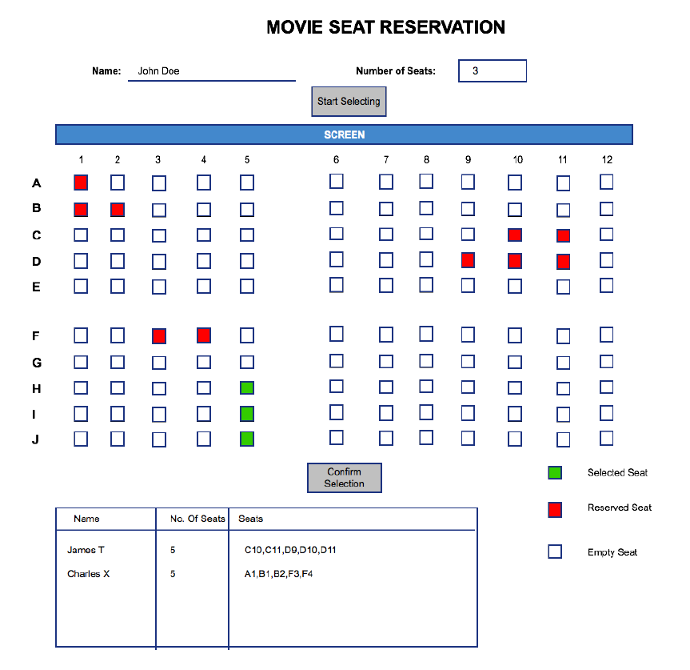

<h3>UI Coding Assignment</h3>

Design a seat reservation system interface for a movie hall. 

 

The interface should have the following capabilities:
<ol>
<li>Must have an input form for the user to enter their name and the number of seats they want to book.</li>
<li>The seat map should be clickable to select seat. The user clicks on empty seats to select them. Clicking on a selected seat would deselect it. The user should be allowed to select only as many seats as they have entered in Step 1.</li>
<li>The user should then click on ‘Confirm’ button to indicate their selection is done.</li>
<li>The page must also have a table that shows the list of users that have reserved seats, the number of seats each has selected and the seat nos. of the seats they have reserved.</li>
<li>The user should not be able to ask for seats more than what is available.</li>
</ol>

A sketch of the expected UI is attached below. You need not handle state across sessions (i.e across page refresh / reload) – you can use browser local storage to hold state.

 

